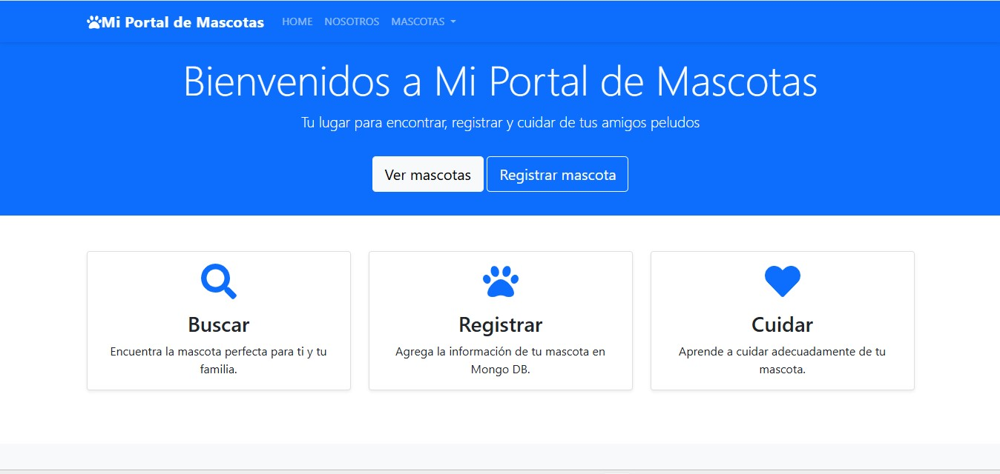
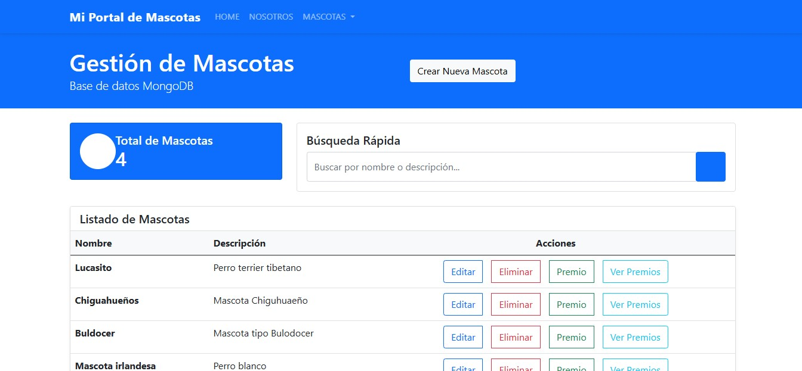

# API RESTful de Gestión de Mascotas

Esta es una **API RESTful** desarrollada en **Node.js** para gestionar información relacionada con mascotas. Utiliza **MongoDB** como base de datos y **EJS** para la renderización de vistas dinámicas. El objetivo principal de esta aplicación es permitir la gestión de mascotas mediante operaciones **CRUD** (Crear, Leer, Actualizar y Eliminar).

## Descripción

La aplicación proporciona una **interfaz web** que se comunica con una API REST, donde puedes realizar las siguientes operaciones sobre los registros de las mascotas:

- **Crear** nuevas mascotas en la base de datos.
- **Leer** información detallada sobre las mascotas.
- **Actualizar** la información de las mascotas existentes.
- **Eliminar** mascotas del sistema.

Además, la aplicación está diseñada para ser escalable y fácil de usar, permitiendo una integración eficiente con MongoDB, lo que facilita el almacenamiento y recuperación de datos relacionados con las mascotas.

## Características

- **API RESTful** para gestionar datos de mascotas.
- **Base de datos MongoDB** para almacenar información de las mascotas.
- **EJS** para la renderización dinámica de vistas del lado del servidor.
- Funciones de CRUD para manejar registros de mascotas.
- **Interfaz sencilla y fácil de usar**.

## Imágenes

Aquí puedes ver algunas imágenes de la interfaz de la aplicación:


*Interfaz principal de la aplicación.*


*Gestión de las mascotas en la base de datos.


## Instalación

### Requisitos previos

Antes de comenzar, asegúrate de tener instalados los siguientes programas:

- **Node.js**: [Descargar Node.js](https://nodejs.org/)
- **MongoDB**: [Instalar MongoDB](https://www.mongodb.com/try/download/community) (si aún no lo tienes configurado)
  
### Clonación y configuración

1. Clona el repositorio a tu máquina local:

    ```bash
    git clone https://github.com/EdisonGP/ImplementacionEJSNode.git
    ```

2. Navega al directorio del proyecto:

    ```bash
    cd TU_REPOSITORIO
    ```

3. Inicia un repositorio Git (solo si es la primera vez que clonas el proyecto):

    ```bash
    git init
    ```

4. Instala las dependencias necesarias utilizando **npm**:

    ```bash
    npm install
    ```

5. Crea un archivo `.env` en el directorio raíz de tu proyecto y agrega tu propia configuración para la conexión a MongoDB:

    ```plaintext
    PORT=<port>
    BBDD=<db_name>
    USER=<db_user>
    PASSWORD=<db_password>
    ```

6. Finalmente, ejecuta la aplicación:

    ```bash
    npm start
    ```

## Uso

- La API RESTful ofrece varias rutas para interactuar con los datos de las mascotas:
  - **GET /mascotas**: Obtiene la lista de todas las mascotas.
  - **POST /mascotas**: Crea una nueva mascota.
  - **GET /mascota/:id**: Obtiene la información de una mascota específica.
  - **PUT /mascota/:id**: Actualiza la información de una mascota.
  - **DELETE /mascota/:id**: Elimina una mascota.

- Puedes interactuar con la aplicación a través de su interfaz web, donde se visualizan los datos de las mascotas y puedes realizar todas las operaciones CRUD directamente desde la interfaz.

## Licencia

Este proyecto está licenciado bajo la **MIT License** - consulta el archivo [LICENSE](LICENSE) para más detalles.

---

**Desarrollado por Edison Guaichico** - [Perfil de GitHub](https://github.com/EdisonGP)

